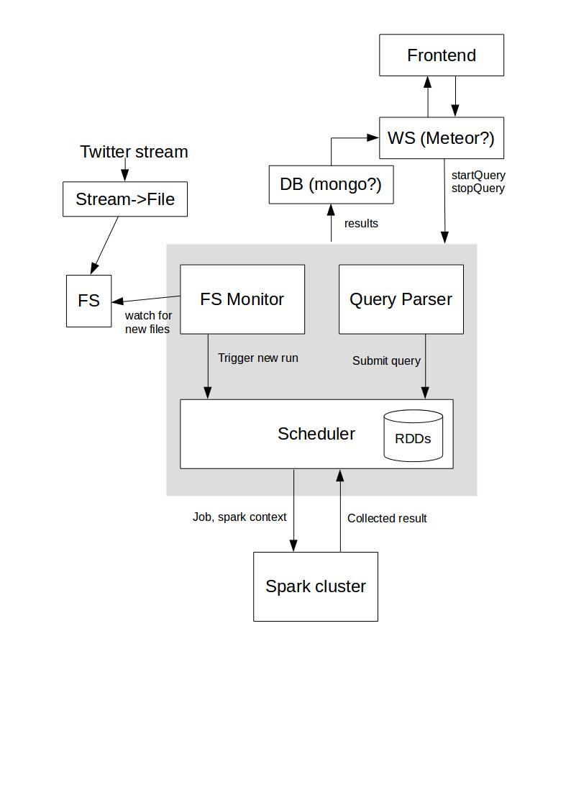

# flexible-spark-streaming
6.S897 class project

## Overview

Instead of modifying Spark core, we'll be building a layer on top of it. To get
started, that layer can be completely independent of the Spark cluster itself.

Our first demo should do the following:
* Consume a stream and trigger computations when new data arrives
* Parse queries in a simple query language (to be defined by us)
* Run the current queries against the data efficiently (by reusing RDDs and
  merging filters and/or groupBy).

A relatively reasonable way to implement the system above in a modular fashion:
1. The File System Monitor: monitors a folder in the file system and triggers
   computation on new files
2. The Scheduler: Figures out whether some parts of the current list of queries
   can be merged into one spark transformation and submits the jobs to spark
3. The Query Parser: Parses a query submitted in our query language and
   transforms it into a query object understood by the scheduler.
4. Presentation Layer: Keeps track of all the queries that users are running and
   delivers the results. Results keep updating as new data comes in.

## Optimizations our system can implement on top of Spark

### Scan sharing
If two queries filter the same data in different ways, only one pass over the
data is technically needed. Instead of running two filter tasks, only one task
is run which outputs data for both (eg. filter all tweets that mention "Hillary"
and all tweets that mention "Bernie")

### Common subexpression
If two filters contain a shared subexpression, one might consider filtering by
the shared subexpression first, then applying the extra filters on top of that.

### Multiple aggregations
If two queries are the same, except that one query groups by language and the 
other one by country, they can share everything but the last reduceByKey
operation. This could be implemented with a map operation that outputs data for
both keys.

## Getting started

It probably makes sense to get started with the simplest possible version of
this system, which will have only the following parts:

* The file system monitor
* The scheduler (which will always run on all the data for now, and only
  implement scan sharing)
* The query parser, which will implement an API that allows only simple filters
  such as a hashtag filter and nothing else to start. It will create a query
  object from that.

I suggest we implement it in python, because we're all familiar with that and it
will allow us to use the python shell to play around and submit queries with.

Once we have the basic system wired up, there's plenty more we could do:

* Support more complex queries and build an actual parser for our syntax
* Do more optimizations in the scheduler
* Make the scheduler optimize even when queries come and go asynchronously
 make the system write the output to MongoDB and use Meteor to keep clients
updated when new results come in.
* automatically add new nodes to the cluster if utilization exceeds a threshold.
* etc.

## Setup

First, download and install Spark. Then, download and install Python 2.7.9. The
Tweepy Python module relies on Python 2.7.9 for improved security measures. If
your system relies on an older version of Python (Ubuntu 14.04LTS uses Python
2.7.6), we recommend using virtualenv to setup a sandboxed environment (see
below). Finally, download and install the Tweepy Python module.

### Virtualenv setup

You can install virtualenv on Ubuntu by running `pip install virtualenv`. Then,
download and install Python 2.7.9 to a specified directory so that it doesn't
interfere with your system's current Python installation (e.g.
/usr/local/lib/python2.7.9). Within the source code directory of this repository,
create a virtual environment by running `virtualenv -p
/path/to/your/python2.7.9/interpreter venv`. For example:

    > virtualenv -p /usr/local/lib/python2.7.9/bin/python venv

This will create a virtual environment called venv within your source code
directory. You can activate the sandbox by running `source venv/bin/activate`.
Lastly, download and install the Tweepy module within your sandbox.

To deactivate the sandbox, simply run `deactivate`.

## Running the code

Right now, our code runs a dummy query on a stream of tweets using Twitter's
streaming API. To run it, you must have Twitter API credentials and the Tweepy
Python module installed on your machine. For setup instructions, see [Setup](#setup).
Then, all you have to do is to make sure that the spark/bin directory is in your
OS's PATH variable. Then run the following:

    > spark-submit scheduler.py watch_dir consumer_key consumer_secret
      access_key access_secret

It should say somewhere in the flurry of log messages the number of tweets that
matched the filter. If everything is running fine, you can get rid of the error
messages by appending `2> /dev/null` to the command above. There's also a settings
file somewhere that we could modify. If you find that, please write it here.

For more details on the available command-line arguments, run:

    > spark-submit scheduler.py -h

## Next steps

* Make the scheduler into a standalone process that communicates with the query parser and the dirwatcher.
* Define our query language
* Define the API for query parser so our webserver will be able to register queries and get results.
* Implement scan sharing for queries with filters over a common range
